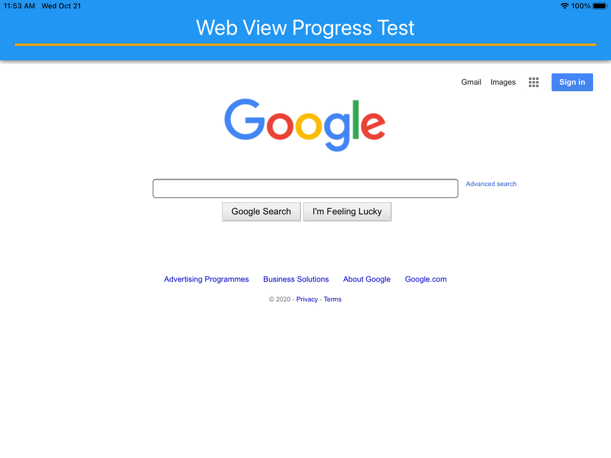
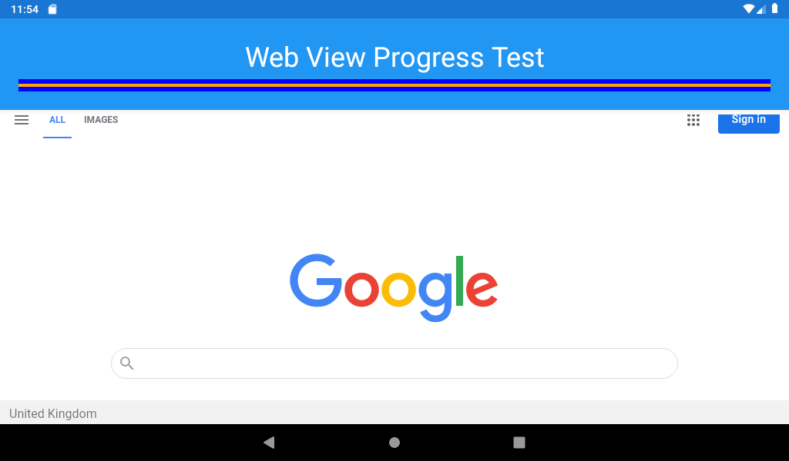
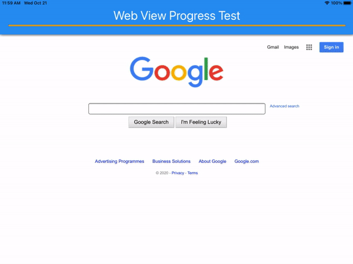
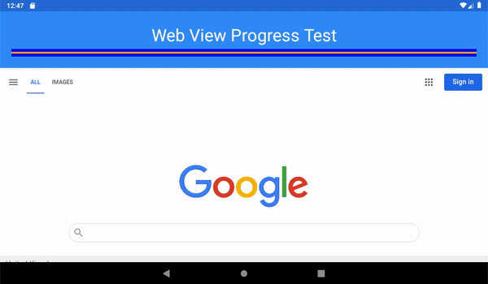

# Web View With Progress
Xamarin Forms Web View With Loading Progress Bar

This proof of concept demonstrates how to obtain the loading progress of the `Xamarin.Forms.Webview` using platform specific renderers, passing the value back from the platform and into your shared code and allowing you to use the value elsewhere in your application.

You can elaborate on the coded example here to build a fully cross platform web browser with progress bar. This differs from examples I found online which tended to use custom renderers to add native progress bars to the web view instead of passing the value back to the forms code.

## Screenshots

| iOS                                        | Android                                            |
| ------------------------------------------ | -------------------------------------------------- |
|  |  |

## Xamarin Forms

I have created 2 controls

| Control              | Purpose                                                      |
| -------------------- | ------------------------------------------------------------ |
| `ProgressWebBrowser` | To provide an example of custom control that uses the `ProgressWebView` and displays a `Xamarin.Forms.ProgressBar` that updates progress accordingly |
| `ProgressWebView`    | Add the progress property to a `WebView`, have custom renderers that are able to hook into native platform API's to get the value and raise a notification. |

`ProgressWebView` has the bindable property `Progress` which gets set by the platform specific renderers.

## iOS

This uses an observer to obeserve the `WKWebView` event **estimatedProgress**.

## Android

This uses a `FormsWebChromeClient` to hook into the `OnProgressChanged` event.

## Future

This repository is a proof of concept, I would suggest following improvments before incorparating in a production app:

- Proper handling of native progress value (android uses int `0-100` & ios + forms use double `0-1`)
- Expose Web View Url Property - In this example I set the website in the `ProgressWebView` constructor.

## Resources Used

I built this sample with help from the following sources:

- [WebViewWithProgressBar Gist by yuv4ik](https://gist.github.com/yuv4ik/a737d3cba45c170626f1ec78bcabb525)
- [Preventing SIGSEV crash on iOS](https://github.com/xamarin/xamarin-macios/issues/4410#issuecomment-403281323)
